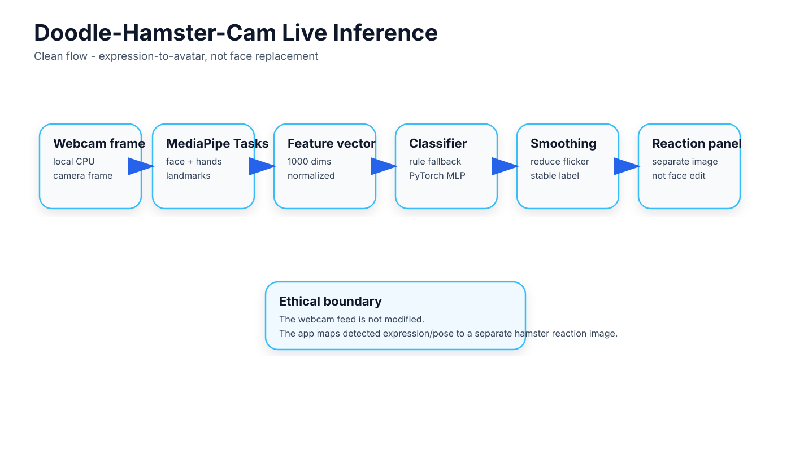
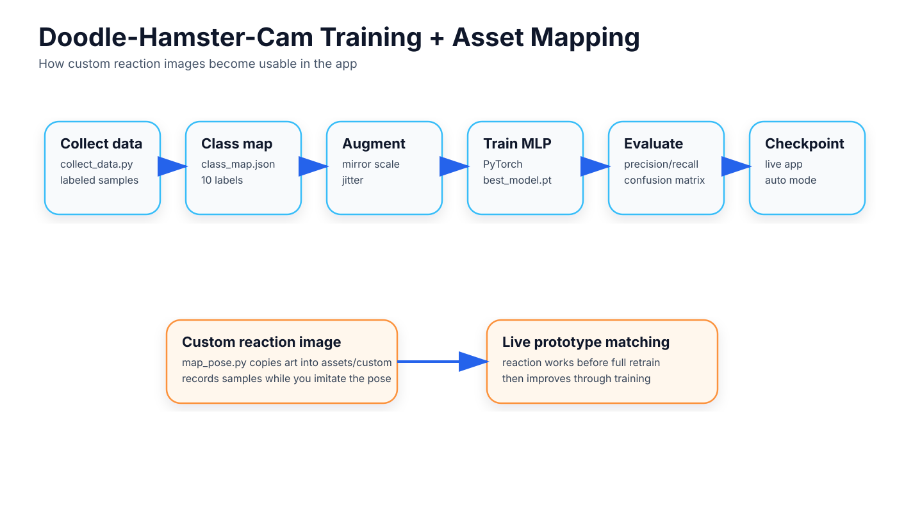
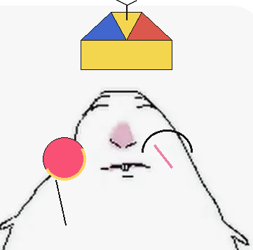
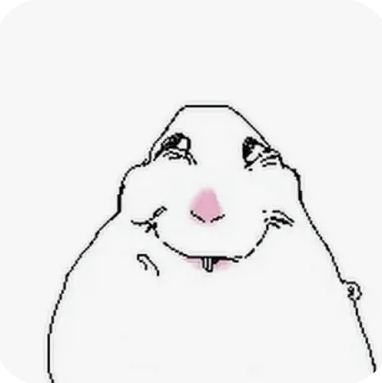
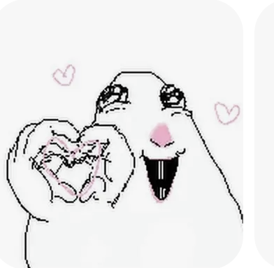

# Doodle Hamster Cam

<p align="center">
  
</p>

Doodle Hamster Cam is a local CPU-friendly webcam prototype that maps face and hand landmarks into a separate hamster reaction panel in real time. It uses MediaPipe Tasks for landmark tracking, a custom PyTorch MLP for learned classification, and a rule-based fallback so the prototype still works before a trained checkpoint exists.

## What it is

This repo is an expression-to-avatar reaction prototype. It does not replace a face in video. Instead, it estimates expression and hand-pose state from landmarks and maps that state to a separate hamster reaction panel.

## System at a glance

| Area | Details |
| --- | --- |
| Runtime | Local, CPU-friendly webcam app |
| Inputs | MediaPipe face landmarks, hand landmarks, and blendshape-assisted rule signals |
| Modes | `auto`, `rule`, `ml` |
| UI | Webcam view, label, confidence, FPS, mode, and reaction panel |
| Mapping flow | `map_pose.py` lets a custom reaction image work before a full retrain |

## Training and mapping flow

<p align="center">
  
</p>

## Reaction examples

The repo already contains committed custom hamster reaction images, so the README can show real in-repo examples without fabricating demo screenshots.

<table>
  <tr>
    <td width="25%" align="center" valign="top">
      <br/>
      <strong>Neutral</strong>
    </td>
    <td width="25%" align="center" valign="top">
      <br/>
      <strong>Happy</strong>
    </td>
    <td width="25%" align="center" valign="top">
      <br/>
      <strong>Shocked</strong>
    </td>
    <td width="25%" align="center" valign="top">
      <br/>
      <strong>Smug</strong>
    </td>
  </tr>
</table>

## Why landmarks plus an MLP

Raw image classification is heavier, harder to debug, and less data-efficient for a real-time expression task on CPU. This project uses normalized face and hand landmarks as the main feature representation because they are:

- fast on CPU
- easier to augment and inspect
- more robust to lighting and background changes
- a cleaner fit for a small custom MLP

For expression quality, the live fallback path also reads MediaPipe face blendshape scores when they are available. The v1 model still trains on the fixed landmark vector, but the code is already structured so blendshapes can be added to the learned feature set later.

## Current capabilities

- Live webcam app with webcam view, label, confidence, FPS, mode, and hamster reaction panel
- MediaPipe Face Landmarker + Hand Landmarker using the current Tasks API
- Rule-based fallback that uses landmarks and face blendshapes
- Prototype pose matching from saved samples, so mapped reactions can start working before a full retrain
- Dataset collection, training, evaluation, and custom reaction mapping scripts
- Placeholder hamster assets generated automatically if missing

## Quick start

Use Python 3.10+.

```bash
python -m venv .venv
.venv\Scripts\activate
pip install -r requirements.txt
python main.py
```

Useful options:

```bash
python main.py --mode auto
python main.py --mode rule
python main.py --mode ml --checkpoint checkpoints/best_model.pt
python main.py --camera-index 1 --no-selfie
```

Hotkeys in the live app:

- `q`: quit
- `m`: toggle ML / rule mode
- `s`: save a screenshot to `captures/`
- `r`: reset the smoothing buffer

<details>
<summary><strong>Developer guide</strong> — layout, data collection, training, evaluation, and custom reactions</summary>

<br/>

## Project layout

```text
doodle-hamster-cam/
├── main.py
├── collect_data.py
├── map_pose.py
├── train.py
├── evaluate.py
├── model.py
├── requirements.txt
├── README.md
├── assets/
├── data/
├── checkpoints/
├── captures/
├── models/
└── utils/
    ├── mediapipe_utils.py
    ├── feature_utils.py
    ├── augment.py
    ├── smoothing.py
    └── display.py
```

## File guide

- `main.py`: runs the live webcam app, loads the model when available, falls back to rules when needed, smooths predictions, and renders the split-screen UI.
- `collect_data.py`: captures labeled landmark feature vectors from the webcam and writes dataset files into `data/`.
- `map_pose.py`: copies a custom reaction image into `assets/custom/`, shows it as a live reference, and records samples while you imitate that pose.
- `train.py`: trains the PyTorch MLP on saved landmark vectors and stores the best checkpoint.
- `evaluate.py`: loads the saved checkpoint and reports validation accuracy, per-class metrics, and a confusion matrix.
- `model.py`: defines the configurable MLP and checkpoint save/load helpers.
- `utils/mediapipe_utils.py`: wraps MediaPipe Tasks setup, model download, detection calls, and landmark drawing.
- `utils/feature_utils.py`: owns the canonical landmark feature format, normalization, blendshape extraction, and rule-based scoring.
- `utils/augment.py`: applies mirror, scale, and jitter augmentation to landmark features during training.
- `utils/smoothing.py`: smooths framewise predictions to reduce flicker in the live app.
- `utils/display.py`: renders the webcam/hamster layout, creates placeholder hamster reaction assets, and saves screenshots.

## Install notes

If you do not pass model paths yourself, the app will download the official MediaPipe `.task` bundles into `models/` the first time you run it.

## Collect data

```bash
python collect_data.py
```

If you already have a real reaction image and want to map your pose directly to it:

```bash
python map_pose.py --label shocked --image path\to\your\shocked.png
```

You can also omit `--label` and derive it from the image filename:

```bash
python map_pose.py --image path\to\bat_hamster.png
```

This will:

- copy your image into `assets/custom/`
- create the label in `data/class_map.json` if it does not exist yet
- show the image beside the webcam while you imitate it
- save samples for that label
- make the live app able to prototype-match that pose from the saved samples
- optionally train immediately if you add `--train-after`

Hotkeys in the collector:

- `1-9` and `0`: choose one of the first 10 labels
- `[` and `]`: cycle through labels
- `space`: save one sample
- `b`: burst capture
- `q`: quit

By default the collector uses this class order:

```text
neutral,happy,shocked,smug,crying,angry,tongue_out,suspicious,peace_pose,phone_pose
```

You can override it for a fresh dataset:

```bash
python collect_data.py --classes neutral,happy,shocked,peace_pose
```

Saved files:

- `data/samples.npy`
- `data/labels.npy`
- `data/class_map.json`
- `data/metadata.json`

## Train

```bash
python train.py
```

Example:

```bash
python train.py --epochs 40 --batch-size 64 --hidden-dims 256,128,64
```

Training pipeline details:

- reproducible train/validation split
- horizontal mirroring
- Gaussian coordinate jitter
- small scale perturbations
- best checkpoint saved to `checkpoints/best_model.pt`

## Evaluate

```bash
python evaluate.py
```

This reuses the exact validation indices stored in the checkpoint and prints:

- overall validation accuracy
- per-class precision / recall / F1
- text confusion matrix

## Add new hamster classes

1. Run `map_pose.py --label your_label --image path\to\image.png` or omit `--label` and let the filename become the label.
2. Capture several samples while imitating that pose or expression.
3. Restart the live app, or press `r` inside it, so it reloads the mapped assets and saved sample prototypes.
4. Train with `train.py` when you want the full MLP to optimize on the expanded label set.

If you do not add art yet, the app will generate placeholder hamster assets automatically.

## Future upgrades

- landmarks + blendshapes as a learned v1.1 feature vector
- compare the custom hand pose classifier against MediaPipe Gesture Recognizer
- per-user calibration
- lightweight temporal models instead of framewise smoothing
- richer hamster art and animated reactions

## Notes

- MediaPipe Tasks is still a preview-style API surface, so the code is written to fail fast on incompatible checkpoint or feature-spec mismatches.
- The current model is designed for CPU inference and a local portfolio-friendly prototype, not a large production dataset.

</details>
